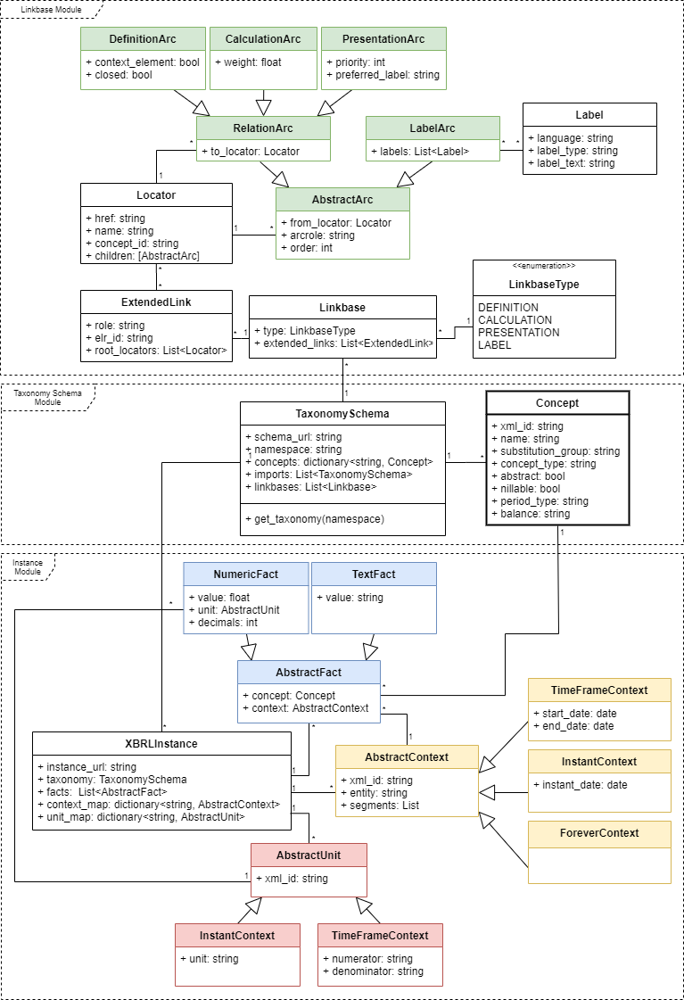

## XBRL-Parser

[](https://www.python.org/)

[](https://pypi.org/project/py-xbrl/#history)
[](https://pypi.org/project/py-xbrl/)
[](https://pypi.org/project/py-xbrl/)
[](https://github.com/manusimidt/xbrl_parser/blob/main/LICENSE)
[](https://pypi.org/project/py-xbrl/)
[](https://github.com/m4nu3l99/xbrl_parser)


> #### DISCLAIMER - BETA PHASE
> This xbrl-parser is currently in a beta phase. Each new release can introduce breaking changes.
> 
> ❗ Feedback: Feel free to ask me any questions, suggestions and ideas in the [discussions form](https://github.com/manusimidt/xbrl_parser/discussions) or contact me directly


This is the documentation for the XBRL Parser. The XBRL Parser consists of 3 Modules. The Instance Document module, the
Taxonomy-Schema module and the Linkbase module.

The functionality and interactions between the different modules are outlined in my bachelor thesis. The goal of this
documentation is to explain how to use the various modules of the XBRL Parser.

### 1 Instance document module

For a quick start just import the parse_XBRL_instance_file or the parse_iXBRL_file and insert the link to the instance
document. The parser will automatically download the Taxonomy-schema as well as all Taxonomies and Linkbases used by the
Instance Document.

##### XBRL Instance Document

```python
from xbrl_parser.instance import parse_xbrl, parse_xbrl_url, XbrlInstance
from xbrl_parser.cache import HttpCache
import logging
logging.basicConfig(level=logging.INFO)
# define a location for caching all xbrl files that must be downloaded for parsing the instance file (taxonomies, linkbases, ...)
cache: HttpCache = HttpCache('./cache/')

# parse from path
instance_path: str = './data/Prod224_0087_05713227_20191231.xml'
inst1: XbrlInstance = parse_xbrl(instance_path, cache)
print(inst1)

# parse from url
instance_url: str = 'https://www.sec.gov/Archives/edgar/data/320193/000032019318000145/aapl-20180929.xml'
inst2: XbrlInstance = parse_xbrl_url(instance_url, cache)
print(inst2)
```

``OUT: Instance Document aapl-20200926.htm with 1329 facts``

If the logging level is lower or equal then INFO the CacheHelper will print out the urls that where cached. These are
displayed in the details sections.

It should be noted that the instance file and the extension taxonomy schema are downloaded first. Then the parser
recursively goes through all the taxonomy imports and downloads them. When all the underlying taxonomies are downloaded
and parsed, the linkbases of the extension taxonomy are read in.

Click on details for the full logs

<details>

```
INFO:src.helper.CacheHelper:200 https://www.sec.gov/Archives/edgar/data/320193/000032019320000096/aapl-20200926.htm
INFO:src.helper.CacheHelper:200 https://www.sec.gov/Archives/edgar/data/320193/000032019320000096/aapl-20200926.xsd
INFO:src.helper.CacheHelper:200 http://xbrl.fasb.org/srt/2020/elts/srt-2020-01-31.xsd
INFO:src.helper.CacheHelper:200 http://www.xbrl.org/2003/xbrl-instance-2003-12-31.xsd
INFO:src.helper.CacheHelper:200 http://www.xbrl.org/2003/xbrl-linkbase-2003-12-31.xsd
INFO:src.helper.CacheHelper:200 http://www.xbrl.org/2003/xl-2003-12-31.xsd
INFO:src.helper.CacheHelper:200 http://www.xbrl.org/2003/xlink-2003-12-31.xsd
INFO:src.helper.CacheHelper:200 http://www.xbrl.org/dtr/type/numeric-2009-12-16.xsd
INFO:src.helper.CacheHelper:200 http://www.xbrl.org/dtr/type/nonNumeric-2009-12-16.xsd
INFO:src.helper.CacheHelper:200 http://www.xbrl.org/2005/xbrldt-2005.xsd
INFO:src.helper.CacheHelper:200 http://www.xbrl.org/2006/ref-2006-02-27.xsd
INFO:src.helper.CacheHelper:200 http://xbrl.fasb.org/srt/2020/elts/srt-types-2020-01-31.xsd
INFO:src.helper.CacheHelper:200 http://xbrl.fasb.org/us-gaap/2020/elts/us-gaap-2020-01-31.xsd
INFO:src.helper.CacheHelper:200 http://xbrl.fasb.org/us-gaap/2020/elts/us-types-2020-01-31.xsd
INFO:src.helper.CacheHelper:200 http://xbrl.fasb.org/us-gaap/2020/elts/us-roles-2020-01-31.xsd
INFO:src.helper.CacheHelper:200 http://xbrl.fasb.org/us-gaap/2020/elts/us-gaap-eedm-def-2020-01-31.xml
INFO:src.helper.CacheHelper:200 http://xbrl.fasb.org/srt/2020/elts/srt-eedm1-def-2020-01-31.xml
INFO:src.helper.CacheHelper:200 https://xbrl.sec.gov/country/2020/country-2020-01-31.xsd
INFO:src.helper.CacheHelper:200 https://xbrl.sec.gov/dei/2020/dei-2020-01-31.xsd
INFO:src.helper.CacheHelper:200 https://www.sec.gov/Archives/edgar/data/320193/000032019320000096/aapl-20200926_cal.xml
INFO:src.helper.CacheHelper:200 https://www.sec.gov/Archives/edgar/data/320193/000032019320000096/aapl-20200926_def.xml
INFO:src.helper.CacheHelper:200 https://www.sec.gov/Archives/edgar/data/320193/000032019320000096/aapl-20200926_lab.xml
INFO:src.helper.CacheHelper:200 https://www.sec.gov/Archives/edgar/data/320193/000032019320000096/aapl-20200926_pre.xml
OUT: Instance Document aapl-20200926.htm with 1329 facts
```

</details>

<br>

##### Inline XBRL Instance Document

```python
from xbrl_parser.instance import parse_ixbrl, parse_ixbrl_url, XbrlInstance
from xbrl_parser.cache import HttpCache
import logging
logging.basicConfig(level=logging.INFO)
# define a location for caching all xbrl files that must be downloaded for parsing the instance file (taxonomies, linkbases, ...)
cache: HttpCache = HttpCache('./cache/')

# parse from local path
instance_path: str = './data/Prod224_0087_02664682_20201231.html'
inst1: XbrlInstance = parse_ixbrl(instance_path, cache)
print(inst1)

# parse from url
instance_url: str = 'https://www.sec.gov/Archives/edgar/data/320193/000032019320000096/aapl-20200926.htm'
inst2: XbrlInstance = parse_ixbrl_url(instance_url, cache)
print(inst2)
```

``OUT: Instance Document aapl-20200926.htm with 1344 facts``

Both functions return exactly the same object structure. So a parsed XBRL Filing looks the same as a parsed iXBRL file.
This structure is further explained in Point 4.

### 2 Taxonomy-schema module

The taxonomy schema module is responsible for parsing the taxonomy schema. This includes parsing the concepts defined in
the taxonomy and extracting linkbase references. The following example code parses the main entry point for the ESEF
taxonomy. The logging output beneath displays all other taxonomy-schemas and linkbases that where imported by the
taxonomy and thus had also to be downloaded and parsed.

```python
from xbrl_parser.taxonomy import parse_taxonomy, TaxonomySchema
from xbrl_parser.cache import HttpCache

schema_url: str = 'https://www.esma.europa.eu/taxonomy/2019-03-27/esef_cor.xsd'
cache: HttpCache = HttpCache('./cache/')

tax: TaxonomySchema = parse_taxonomy(cache, schema_url)
```

Output:
<details>

```
INFO:src.helper.CacheHelper:200 https://www.esma.europa.eu/taxonomy/2019-03-27/esef_cor.xsd
INFO:src.helper.CacheHelper:200 http://www.xbrl.org/2003/xbrl-instance-2003-12-31.xsd
INFO:src.helper.CacheHelper:200 http://www.xbrl.org/2003/xbrl-linkbase-2003-12-31.xsd
INFO:src.helper.CacheHelper:200 http://www.xbrl.org/2003/xl-2003-12-31.xsd
INFO:src.helper.CacheHelper:200 http://www.xbrl.org/2003/xlink-2003-12-31.xsd
INFO:src.helper.CacheHelper:200 http://www.esma.europa.eu/taxonomy/ext/technical.xsd
INFO:src.helper.CacheHelper:200 http://www.xbrl.org/2005/xbrldt-2005.xsd
INFO:src.helper.CacheHelper:200 http://www.xbrl.org/taxonomy/int/lei/CR/2018-11-01/lei-required.xsd
INFO:src.helper.CacheHelper:200 http://www.xbrl.org/taxonomy/int/lei/CR/2018-11-01/lei.xsd
INFO:src.helper.CacheHelper:200 http://www.xbrl.org/taxonomy/int/lei/CR/2018-11-01/lei-formula.xml
INFO:src.helper.CacheHelper:200 http://www.xbrl.org/taxonomy/int/lei/CR/2018-11-01/lei-label.xml
INFO:src.helper.CacheHelper:200 http://www.xbrl.org/taxonomy/int/lei/CR/2018-11-01/lei-required-formula.xml
INFO:src.helper.CacheHelper:200 http://xbrl.ifrs.org/taxonomy/2019-03-27/full_ifrs/labels/in_full_ifrs-en_2019-03-27.xml
INFO:src.helper.CacheHelper:200 http://xbrl.ifrs.org/taxonomy/2019-03-27/full_ifrs/labels/lab_full_ifrs-en_2019-03-27.xml
INFO:src.helper.CacheHelper:200 http://xbrl.ifrs.org/taxonomy/2019-03-27/full_ifrs/labels/doc_full_ifrs-en_2019-03-27.xml
INFO:src.helper.CacheHelper:200 http://xbrl.ifrs.org/taxonomy/2019-03-27/full_ifrs/linkbases/ias_1/ref_ias_1_2019-03-27.xml
INFO:src.helper.CacheHelper:200 http://xbrl.ifrs.org/taxonomy/2019-03-27/full_ifrs/linkbases/ias_10/ref_ias_10_2019-03-27.xml
INFO:src.helper.CacheHelper:200 http://xbrl.ifrs.org/taxonomy/2019-03-27/full_ifrs/linkbases/ias_12/ref_ias_12_2019-03-27.xml
INFO:src.helper.CacheHelper:200 http://xbrl.ifrs.org/taxonomy/2019-03-27/full_ifrs/linkbases/ias_16/ref_ias_16_2019-03-27.xml
INFO:src.helper.CacheHelper:200 http://xbrl.ifrs.org/taxonomy/2019-03-27/full_ifrs/linkbases/ias_19/ref_ias_19_2019-03-27.xml
INFO:src.helper.CacheHelper:200 http://xbrl.ifrs.org/taxonomy/2019-03-27/full_ifrs/linkbases/ias_2/ref_ias_2_2019-03-27.xml
INFO:src.helper.CacheHelper:200 http://xbrl.ifrs.org/taxonomy/2019-03-27/full_ifrs/linkbases/ias_20/ref_ias_20_2019-03-27.xml
INFO:src.helper.CacheHelper:200 http://xbrl.ifrs.org/taxonomy/2019-03-27/full_ifrs/linkbases/ias_21/ref_ias_21_2019-03-27.xml
INFO:src.helper.CacheHelper:200 http://xbrl.ifrs.org/taxonomy/2019-03-27/full_ifrs/linkbases/ias_23/ref_ias_23_2019-03-27.xml
INFO:src.helper.CacheHelper:200 http://xbrl.ifrs.org/taxonomy/2019-03-27/full_ifrs/linkbases/ias_24/ref_ias_24_2019-03-27.xml
INFO:src.helper.CacheHelper:200 http://xbrl.ifrs.org/taxonomy/2019-03-27/full_ifrs/linkbases/ias_26/ref_ias_26_2019-03-27.xml
INFO:src.helper.CacheHelper:200 http://xbrl.ifrs.org/taxonomy/2019-03-27/full_ifrs/linkbases/ias_27/ref_ias_27_2019-03-27.xml
INFO:src.helper.CacheHelper:200 http://xbrl.ifrs.org/taxonomy/2019-03-27/full_ifrs/linkbases/ias_29/ref_ias_29_2019-03-27.xml
INFO:src.helper.CacheHelper:200 http://xbrl.ifrs.org/taxonomy/2019-03-27/full_ifrs/linkbases/ias_33/ref_ias_33_2019-03-27.xml
INFO:src.helper.CacheHelper:200 http://xbrl.ifrs.org/taxonomy/2019-03-27/full_ifrs/linkbases/ias_34/ref_ias_34_2019-03-27.xml
INFO:src.helper.CacheHelper:200 http://xbrl.ifrs.org/taxonomy/2019-03-27/full_ifrs/linkbases/ias_36/ref_ias_36_2019-03-27.xml
INFO:src.helper.CacheHelper:200 http://xbrl.ifrs.org/taxonomy/2019-03-27/full_ifrs/linkbases/ias_37/ref_ias_37_2019-03-27.xml
INFO:src.helper.CacheHelper:200 http://xbrl.ifrs.org/taxonomy/2019-03-27/full_ifrs/linkbases/ias_38/ref_ias_38_2019-03-27.xml
INFO:src.helper.CacheHelper:200 http://xbrl.ifrs.org/taxonomy/2019-03-27/full_ifrs/linkbases/ias_40/ref_ias_40_2019-03-27.xml
INFO:src.helper.CacheHelper:200 http://xbrl.ifrs.org/taxonomy/2019-03-27/full_ifrs/linkbases/ias_41/ref_ias_41_2019-03-27.xml
INFO:src.helper.CacheHelper:200 http://xbrl.ifrs.org/taxonomy/2019-03-27/full_ifrs/linkbases/ias_7/ref_ias_7_2019-03-27.xml
INFO:src.helper.CacheHelper:200 http://xbrl.ifrs.org/taxonomy/2019-03-27/full_ifrs/linkbases/ias_8/ref_ias_8_2019-03-27.xml
INFO:src.helper.CacheHelper:200 http://xbrl.ifrs.org/taxonomy/2019-03-27/full_ifrs/linkbases/ifric_2/ref_ifric_2_2019-03-27.xml
INFO:src.helper.CacheHelper:200 http://xbrl.ifrs.org/taxonomy/2019-03-27/full_ifrs/linkbases/ifric_5/ref_ifric_5_2019-03-27.xml
INFO:src.helper.CacheHelper:200 http://xbrl.ifrs.org/taxonomy/2019-03-27/full_ifrs/linkbases/ifrs_1/ref_ifrs_1_2019-03-27.xml
INFO:src.helper.CacheHelper:200 http://xbrl.ifrs.org/taxonomy/2019-03-27/full_ifrs/linkbases/ifrs_12/ref_ifrs_12_2019-03-27.xml
INFO:src.helper.CacheHelper:200 http://xbrl.ifrs.org/taxonomy/2019-03-27/full_ifrs/linkbases/ifrs_13/ref_ifrs_13_2019-03-27.xml
INFO:src.helper.CacheHelper:200 http://xbrl.ifrs.org/taxonomy/2019-03-27/full_ifrs/linkbases/ifrs_14/ref_ifrs_14_2019-03-27.xml
INFO:src.helper.CacheHelper:200 http://xbrl.ifrs.org/taxonomy/2019-03-27/full_ifrs/linkbases/ifrs_15/ref_ifrs_15_2019-03-27.xml
INFO:src.helper.CacheHelper:200 http://xbrl.ifrs.org/taxonomy/2019-03-27/full_ifrs/linkbases/ifrs_16/ref_ifrs_16_2019-03-27.xml
INFO:src.helper.CacheHelper:200 http://xbrl.ifrs.org/taxonomy/2019-03-27/full_ifrs/linkbases/ifrs_17/ref_ifrs_17_2019-03-27.xml
INFO:src.helper.CacheHelper:200 http://xbrl.ifrs.org/taxonomy/2019-03-27/full_ifrs/linkbases/ifrs_2/ref_ifrs_2_2019-03-27.xml
INFO:src.helper.CacheHelper:200 http://xbrl.ifrs.org/taxonomy/2019-03-27/full_ifrs/linkbases/ifrs_3/ref_ifrs_3_2019-03-27.xml
INFO:src.helper.CacheHelper:200 http://xbrl.ifrs.org/taxonomy/2019-03-27/full_ifrs/linkbases/ifrs_4/ref_ifrs_4_2019-03-27.xml
INFO:src.helper.CacheHelper:200 http://xbrl.ifrs.org/taxonomy/2019-03-27/full_ifrs/linkbases/ifrs_5/ref_ifrs_5_2019-03-27.xml
INFO:src.helper.CacheHelper:200 http://xbrl.ifrs.org/taxonomy/2019-03-27/full_ifrs/linkbases/ifrs_6/ref_ifrs_6_2019-03-27.xml
INFO:src.helper.CacheHelper:200 http://xbrl.ifrs.org/taxonomy/2019-03-27/full_ifrs/linkbases/ifrs_7/ref_ifrs_7_2019-03-27.xml
INFO:src.helper.CacheHelper:200 http://xbrl.ifrs.org/taxonomy/2019-03-27/full_ifrs/linkbases/ifrs_8/ref_ifrs_8_2019-03-27.xml
INFO:src.helper.CacheHelper:200 http://xbrl.ifrs.org/taxonomy/2019-03-27/full_ifrs/linkbases/sic_29/ref_sic_29_2019-03-27.xml
INFO:src.helper.CacheHelper:200 https://www.esma.europa.eu/taxonomy/2019-03-27/esef_cor-for.xml
INFO:src.helper.CacheHelper:200 https://www.esma.europa.eu/taxonomy/2019-03-27/esef_cor-dim.xml
```

</details>

### 3 Linkbase module

With the linkbase module you can parse linkbases. Due to their similar structure all linkbase objects use the same
class. The type of the linkbase is specified by the enum "LinkbaseType"
and stored in the parameter "type" of the linkbase class.

```python
from xbrl_parser.linkbase import parse_linkbase, Linkbase, LinkbaseType
from xbrl_parser.cache import HttpCache

cache: HttpCache = HttpCache('./cache/')

label_linkbase: str = 'https://www.sec.gov/Archives/edgar/data/320193/000032019318000145/aapl-20180929_lab.xml'
definition_linkbase: str = 'https://www.sec.gov/Archives/edgar/data/320193/000032019318000145/aapl-20180929_def.xml'
calculation_linkbase: str = 'https://www.sec.gov/Archives/edgar/data/320193/000032019318000145/aapl-20180929_cal.xml'
presentation_linkbase: str = 'https://www.sec.gov/Archives/edgar/data/320193/000032019318000145/aapl-20180929_pre.xml'

lab_link: Linkbase = parse_linkbase(cache, label_linkbase, LinkbaseType.LABEL)
def_link: Linkbase = parse_linkbase(cache, label_linkbase, LinkbaseType.DEFINITION)
cal_link: Linkbase = parse_linkbase(cache, label_linkbase, LinkbaseType.CALCULATION)
pre_link: Linkbase = parse_linkbase(cache, label_linkbase, LinkbaseType.PRESENTATION)

```

### 4 XBRL Object instances

The parser stores the parsed filing into a structure of object instances. This structure will be explained in the
following diagram.


